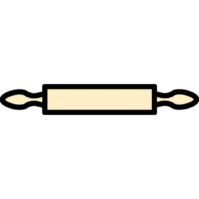

Hey there!
- 🖥️ For C projects, check out our CLI [Minishell](https://github.com/kaulin/42_minishell) or raycasting game [Cub3D](https://github.com/em1e/cub3d)
- 🌱 I’m currently learning C++, Docker, C# and the .NET ecosystem.

*Kaulin is Finnish for a rolling pin. I own one but rarely use it.*

<!--
**kaulin/kaulin** is a ✨ _special_ ✨ repository because its `README.md` (this file) appears on your GitHub profile.

Here are some ideas to get you started:

- 🔭 I’m currently working on ...
- 👯 I’m looking to collaborate on ...
- 🤔 I’m looking for help with ...
- 💬 Ask me about ...
- 📫 How to reach me: ...
- 😄 Pronouns: ...
- ⚡ Fun fact: ...
-->
